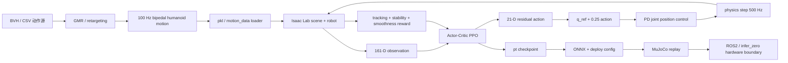
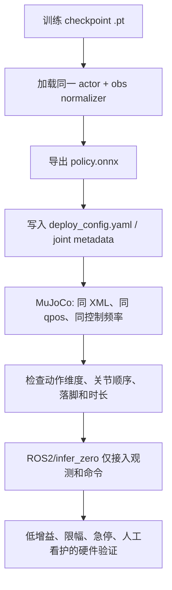
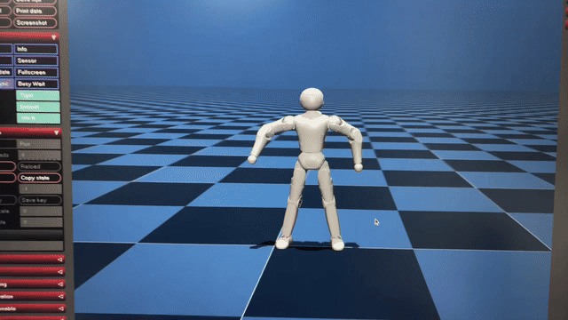
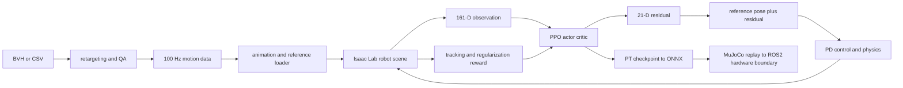

<p align='center'><a href='#zh'>中文</a> | <a href='#en'>English</a></p>
<a id='zh'></a>

# 跳舞全身训练架构（DeepMimic）

## 1. 项目定位

本项目是双足人形机器人的 21-DOF 全身舞蹈模仿训练链路。训练在本地 Isaac Lab/LeggedLab 环境中运行，使用参考动作驱动的 DeepMimic residual policy：参考动作提供主体姿态，策略输出小幅 residual，再由关节位置控制器执行。当前 H 版部署契约是 `161 -> 21`，不要与独立的 `159 -> 21` URDF-order 侧滚契约混用。

| 项目项 | 当前契约 |
|---|---|
| Train task | `LeggedLab-Isaac--Deepmimic-Lens110-v0` |
| Play task | `LeggedLab-Isaac--Deepmimic-Lens110-Play-v0` |
| policy observation | `161` |
| action | `21`，按双足人形机器人 H 版关节顺序 |
| 仿真频率 / policy 频率 | `500 Hz / 100 Hz` |
| 控制语义 | `q_des = q_ref + 0.25 * clip(action)` |
| 主要算法 | DeepMimic reference tracking + PPO |

## 2. 原理

DeepMimic 不直接让策略从零生成一套舞蹈，而是把动作数据变成每个策略时刻的参考状态。环境读取当前机器人状态和当前/未来参考帧，策略学习如何用 residual 修正参考关节目标，使机器人在动力学、接触和扰动下仍保持动作风格。

每个控制周期的核心计算为：

```text
reference frame -> q_ref
policy observation = robot state + future reference features
policy action = a_residual in [-1, 1]^21
q_des = q_ref + 0.25 * clip(a_residual)
joint-position controller -> simulator
```

参考跟踪项使用指数误差形式，误差越小奖励越接近 1：

```text
r_track(e) = exp(-||e||² / std²)
R_env = sum(weight_i * r_i) + termination terms
```

PPO 用 rollout 中的状态、动作、奖励和 value 估计更新 actor/critic；DeepMimic 风格来自参考跟踪奖励，不额外引入 AMP discriminator。动作数据本身仍需先完成坐标系、四元数、关节顺序、采样频率和限位检查。

## 3. 总体流程图



## 4. 训练框架构成

| 层 | 构成 | 作用 |
|---|---|---|
| Motion data | `data/training/deepmimic_motion`、pkl、参考帧 | 提供 root、关键刚体和 21 个关节的参考轨迹 |
| Scene | Isaac Lab ManagerBased RL scene、双足人形机器人 URDF/资产、接触传感器 | 提供动力学、碰撞、地面和状态 |
| Observation manager | 当前本体状态、未来参考帧、足端接触 | 拼接 actor 输入并保持顺序 |
| Action manager | 21-D joint position residual | 将归一化 action 转成参考关节目标 |
| Reward manager | 参考跟踪、存活、力矩、加速度、动作变化 | 形成每个环境步的标量奖励 |
| Termination manager | 接触、低高度、姿态、root/key body 偏差、动作结束 | 处理失败和参考序列结束 |
| RL runner | RSL-RL PPO actor-critic、rollout、advantage、checkpoint | 优化 policy 和 value |
| Export | `convert_pt_to_onnx_lens110.py`、policy、metadata、deploy config | 固化推理接口，供 MuJoCo 和 ROS2 使用 |

关键源码入口：

- 环境配置：`frameworks/shared/lens110_isaaclab/lens110/legged_lab_lbot/source/legged_lab/legged_lab/tasks/locomotion/deepmimic/config/lens110/lens110_deepmimic_env_cfg.py`。
- 通用训练框架：`frameworks/shared/lens110_isaaclab`。
- 动作转换：`tools/retargeting/gmr_lens110` 和 `tools/retargeting/robot_retargeter`。
- 训练入口：`scripts/train.sh`。

## 5. Observation 函数和维度

actor 输入按配置中的 term 顺序拼接，不能只按名字排序或自行交换。`root_rot_tan_norm` 使用 6D rotation tangent representation，避免直接把四元数符号跳变交给网络。

| Observation term | 维度 | 含义 |
|---|---:|---|
| `root_rot_tan_norm` | 6 | 根部相对方向的连续旋转表示 |
| `root_ang_vel_w` | 3 | 世界系根部角速度 |
| `joint_pos` | 21 | 当前关节位置或相对默认位置 |
| `joint_vel` | 21 | 当前关节速度 |
| `ref_root_rot` | 24 | 未来 4 帧 root rotation，每帧 6 维 |
| `ref_joint_pos` | 84 | 未来 4 帧参考关节位置，每帧 21 维 |
| `foot_contact` | 2 | 左右足接触状态 |
| **总计** | **161** | `6+3+21+21+4*6+4*21+2` |

动作是 21 维 residual；参考当前帧不属于 action。训练时可启用 observation corruption，但导出/PLAY/真机前必须关闭随机噪声或确保导出接口包含同一套 normalization。

## 6. Reward 函数由什么构成

环境奖励由 7 个参考跟踪项、1 个 alive 项和 3 个正则项组成。每项先计算无量纲函数值，再乘以配置权重后由 RewardManager 求和。

| 类别 | Reward term | 权重 | 作用 |
|---|---|---:|---|
| 参考 root | `ref_track_root_pos_error_exp` | `+0.15` | root 平移跟踪 |
| 参考 root | `ref_track_root_rot_error_exp` | `+0.15` | root 姿态跟踪 |
| 参考 root | `ref_track_root_lin_vel_error_exp` | `+0.10` | root 线速度跟踪 |
| 参考 root | `ref_track_root_ang_vel_error_exp` | `+0.05` | root 角速度跟踪 |
| 参考关键点 | `ref_track_key_body_pos_error_exp` | `+0.30` | 关键刚体位置和整体形态跟踪 |
| 参考关节 | `ref_track_dof_pos_error_exp` | `+0.80` | 21 个关节角跟踪，环境奖励中权重最大 |
| 参考关节 | `ref_track_dof_vel_error_exp` | `+0.10` | 关节速度/动态节奏跟踪 |
| 生存 | `alive` | `+0.20` | 未触发失败终止时保持正反馈 |
| 正则 | `torques` | `-1e-6` | 抑制过大力矩 |
| 正则 | `joint_acc` | `-2.5e-8` | 抑制高频关节加速度 |
| 正则 | `action_rate_l2_scaled` | `-0.001` | 惩罚 residual/action 的突变，按 `0.25` 缩放后的目标空间计算 |

终止条件不是正奖励项：base 接触、base 高度低于约 `0.3 m`、姿态约超过 `40°`、root 偏差约 `1.2 m`、关键点偏差约 `1.5 m`、参考动作完成都由 TerminationManager 处理。终止时的回报影响通过 episode 结束以及对应的终止惩罚实现，不能把终止阈值写成 reward weight。

## 7. 数据、训练和导出目录

```text
data/
├── raw/bvh/                         # 原始动作源，不直接喂给 policy
├── processed/retargeted_actions/    # GMR/robot-retargeter 输出和质量检查结果
└── training/deepmimic_motion/       # pkl/motion_data，训练 loader 的直接输入
experiments/deepmimic_runs/         # TensorBoard、checkpoint、config snapshot
exports/
├── packages/                        # 可交付包
└── versions/                        # 带 deploy config 和回放说明的版本包
docs/
├── REWARD_STRUCTURE.md              # 本项目奖励证据
└──                                 # 奖励证据和复现记录
```

## 8. 本地复现

在包含 `isaaclab`/`legged_lab` 依赖的本机环境中执行：

```bash
./projects/01_dance_whole_body/scripts/train.sh --headless --num_envs 1024 --max_iterations 60000
```

开始训练前检查：

1. `motion_data_weights` 中的名称与 `data/training/deepmimic_motion` 中的 pkl 同名。
2. policy 输入为 161、输出为 21，且 action scale 为 0.25。
3. 参考动作已经通过位置、速度、四元数、限位、地面高度和播放检查。
4. 训练日志和 checkpoint 记录 seed、任务 ID、代码版本、动作集合和环境数量。

## 9. 导出、MuJoCo 和真机部署



导出包至少包含 `policy.onnx` 或对应策略文件、`deploy_config.yaml`、机器人 XML/URDF、需要的 mesh、动作/参考元数据、关节顺序和回放命令。MuJoCo 的 qpos 根四元数使用 `wxyz`；GMR/部署 CSV 约定为 `xyzw`，跨文件转换必须显式写在转换脚本中。

真机侧只允许加载与训练契约完全一致的 21 关节顺序、动作缩放、PD/力矩限幅和观测归一化；仿真回放通过不代表可以直接切换机器人控制模式。硬件测试先做静态站立和小动作，再做短时舞蹈，并保留急停与回退策略。

## 10. 复现验收清单

- [ ] 本地依赖路径可解析，没有 `/home/ht`、`/home/orangepi` 等外部绝对路径。
- [ ] motion loader 能加载全部声明的 pkl，且采样频率为 100 Hz。
- [ ] 161 维 observation 与 21 维 action 运行时探针一致。
- [ ] checkpoint 可以在对应任务 PLAY。
- [ ] MuJoCo XML 的 mesh、关节顺序、四元数和控制周期一致。
- [ ] ONNX 输入输出、normalizer、action scale 和 deploy config 已互相核对。
- [ ] 真机验证记录了限位、接触、温度、电流、急停和回退结果。

## 项目演示



GIF 是 README 直接展示的演示片段；原始 MP4 保留在 `docs/media/dance-demo.mp4` 供下载和复核。

<a id='en'></a>

# Whole-Body Dance Training Architecture (DeepMimic)

## 1. Scope and contract

This repository contains the 21-DOF whole-body dance imitation pipeline for a bipedal humanoid robot. It uses Isaac Lab/LeggedLab, reference-motion DeepMimic tracking, and PPO. The current H-line policy contract is 161 observations to 21 residual joint-position actions at 500 Hz physics and 100 Hz policy frequency. It is separate from the 159-dimensional URDF-order side-roll contract.

The reference motion supplies the nominal pose. The actor observes robot state and future reference features, predicts a bounded residual, and the action manager applies `q_des = q_ref + 0.25 * clip(action)`. Exponential tracking terms, survival, torque/acceleration/action-rate regularization, and explicit termination gates form the environment objective.

## 2. Architecture



## 3. Observation and reward

The 161 dimensions are `6 root rotation + 3 root angular velocity + 21 joint positions + 21 joint velocities + 24 future root rotations + 84 future joint positions + 2 foot contacts`. The 24 and 84 components contain four future reference frames. The 21 actions are residuals, not absolute joint angles.

The environment reward weights are: root position `+0.15`, root rotation `+0.15`, root linear velocity `+0.10`, root angular velocity `+0.05`, key-body position `+0.30`, DOF position `+0.80`, DOF velocity `+0.10`, alive `+0.20`, torque `-1e-6`, joint acceleration `-2.5e-8`, and scaled action rate `-0.001`. Base contact, low base height, bad orientation, large root/key-body error, and reference completion are termination logic, not positive rewards.

## 4. Reproduction and deployment

Run `./projects/01_dance_whole_body/scripts/train.sh --headless --num_envs 1024 --max_iterations 60000` with the local Isaac Lab environment. Verify motion names, 161/21 dimensions, the 0.25 residual scale, replay, and deployment metadata before export. Keep raw motion, retargeted motion, training runs, checkpoints, exports, and validation records in their respective directories.

MuJoCo qpos stores the root quaternion as `wxyz`; GMR/deployment CSV uses `xyzw`. The conversion must be explicit. A hardware run additionally requires matching joint order, action scaling, PD/effort limits, normalization, emergency stop, and supervised staged testing.
